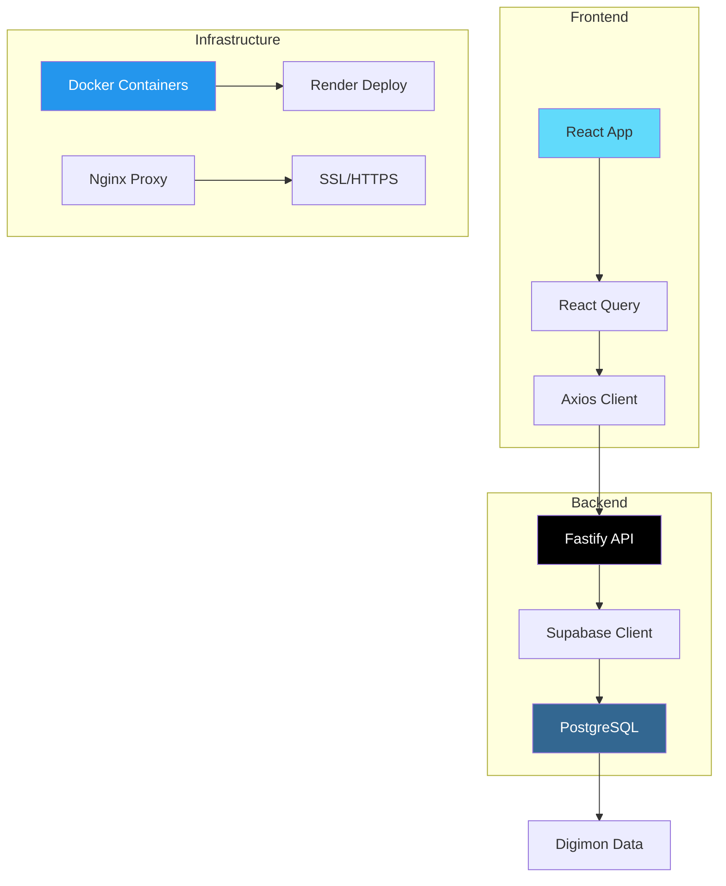

# 🔥 Digimon Evolution - Enciclopédia Completa

Uma aplicação web moderna e completa para explorar o universo dos Digimons, suas evoluções e requisitos evolutivos. Desenvolvida com arquitetura API+Frontend, containerizada com Docker e pronta para deploy em produção.


## 🌟 Funcionalidades

### 🔍 **Busca Inteligente**
- Busca em tempo real por nome de Digimon
- Resultados instantâneos com debounce otimizado
- Sugestões e autocomplete

### 📊 **Visualização Completa**
- Lista todos os Digimons organizados por stages
- Filtros dinâmicos por atributos e estágios
- Interface responsiva e moderna

### 🌳 **Árvore Evolutiva**
- Visualização completa da linha evolutiva
- Predecessores e sucessores
- Requisitos detalhados para cada evolução

### ⚡ **Performance Otimizada**
- Cache inteligente com React Query
- Lazy loading de componentes
- Imagens otimizadas com fallback

### 🎨 **Interface Moderna**
- Design responsivo para todos os dispositivos
- Tema dark/light automático
- Animações suaves e transições

## 🏗️ Arquitetura



## 🚀 Início Rápido

### Pré-requisitos
- Node.js 18+
- Docker & Docker Compose
- Conta no Supabase (gratuita)

### 1. Clone o Repositório
```bash
git clone https://github.com/seu-usuario/digimon-evolution.git
cd digimon-evolution
```

### 2. Configure o Banco de Dados
```bash
# Siga as instruções em supabase_setup.md
# 1. Criar projeto no Supabase
# 2. Executar schema SQL
# 3. Migrar dados do JSON
```

### 3. Configure Variáveis de Ambiente
```bash
cp .env.docker.example .env
# Edite o arquivo .env com suas configurações do Supabase
```

### 4. Execute com Docker
```bash
# Desenvolvimento
./scripts/build.sh dev

# Produção
./scripts/build.sh prod
```

### 5. Acesse a Aplicação
- **Frontend**: http://localhost:5173
- **API**: http://localhost:3001
- **Documentação**: http://localhost:3001/docs

## 📁 Estrutura do Projeto

```
digimon-evolution/
├── 📁 digimon-api/              # Backend Fastify
│   ├── 📁 src/
│   │   ├── 📁 routes/           # Rotas da API
│   │   ├── 📁 services/         # Lógica de negócio
│   │   ├── 📁 middleware/       # Middlewares
│   │   └── 📄 server.js         # Servidor principal
│   ├── 📄 Dockerfile            # Container da API
│   └── 📄 package.json
│
├── 📁 digimon-frontend/         # Frontend React
│   ├── 📁 src/
│   │   ├── 📁 components/       # Componentes React
│   │   ├── 📁 hooks/            # Hooks customizados
│   │   ├── 📁 lib/              # Utilitários
│   │   └── 📄 App.jsx           # App principal
│   ├── 📄 Dockerfile            # Container do Frontend
│   └── 📄 package.json
│
├── 📁 scripts/                  # Scripts de automação
│   ├── 📄 build.sh              # Build e deploy local
│   ├── 📄 deploy-render.sh      # Preparação para Render
│   └── 📄 verify-deploy.sh      # Verificação pós-deploy
│
├── 📁 deploy/                   # Arquivos de deploy
│   ├── 📄 render.yaml           # Configuração do Render
│   └── 📄 DEPLOY_INSTRUCTIONS.md
│
├── 📄 docker-compose.yml        # Desenvolvimento
├── 📄 docker-compose.prod.yml   # Produção
├── 📄 render.yaml               # Deploy automático
└── 📄 README.md                 # Este arquivo
```

## 🛠️ Tecnologias

### Backend
- **[Fastify](https://fastify.io/)** - Framework web rápido e eficiente
- **[Supabase](https://supabase.com/)** - Backend-as-a-Service com PostgreSQL
- **[Docker](https://docker.com/)** - Containerização

### Frontend
- **[React 19](https://react.dev/)** - Framework frontend
- **[Vite](https://vitejs.dev/)** - Build tool moderna
- **[Tailwind CSS](https://tailwindcss.com/)** - Framework CSS utilitário
- **[shadcn/ui](https://ui.shadcn.com/)** - Componentes UI
- **[React Query](https://tanstack.com/query)** - Gerenciamento de estado
- **[Axios](https://axios-http.com/)** - Cliente HTTP

### DevOps
- **[Docker Compose](https://docs.docker.com/compose/)** - Orquestração local
- **[Render](https://render.com/)** - Plataforma de deploy
- **[GitHub Actions](https://github.com/features/actions)** - CI/CD

## 📚 Documentação

### Guias Principais
- 📖 [Configuração do Supabase](supabase_setup.md)
- 🐳 [Guia Docker](DOCKER_GUIDE.md)
- 🚀 [Deploy no Render](RENDER_DEPLOY_GUIDE.md)

### APIs e Componentes
- 🔧 [Documentação da API](digimon-api/README.md)
- 🎨 [Documentação do Frontend](digimon-frontend/README.md)

### Scripts e Automação
- ⚙️ Scripts de build e deploy em `/scripts/`
- 🔄 Workflows de CI/CD em `/.github/workflows/`

## 🚀 Deploy em Produção

### Opção 1: Deploy Automático (Recomendado)
```bash
# 1. Preparar arquivos
./scripts/deploy-render.sh

# 2. Commit e push
git add .
git commit -m "feat: prepare for production deploy"
git push origin main

# 3. Configurar no Render usando render.yaml
```

### Opção 2: Deploy Manual
Siga o guia detalhado em [RENDER_DEPLOY_GUIDE.md](RENDER_DEPLOY_GUIDE.md)

### Verificação Pós-Deploy
```bash
# Verificar se tudo está funcionando
./scripts/verify-deploy.sh https://sua-api.onrender.com https://seu-frontend.onrender.com
```

## 🔧 Desenvolvimento

### Executar Localmente
```bash
# API apenas
cd digimon-api
npm install
npm run dev

# Frontend apenas
cd digimon-frontend
npm install
npm run dev

# Ambos com Docker
docker-compose up -d
```

### Comandos Úteis
```bash
# Ver logs
docker-compose logs -f

# Reiniciar serviços
docker-compose restart

# Rebuild completo
docker-compose down && docker-compose up --build

# Limpeza
docker system prune -a
```

## 📊 Dados

### Fonte dos Dados
- **1000+ Digimons** com informações completas
- **2000+ Evoluções** mapeadas
- **500+ Requisitos** de evolução detalhados

### Estrutura do Banco
- **digimons**: Informações básicas (nome, stage, atributo)
- **evolutions**: Relacionamentos evolutivos
- **evolution_requirements**: Requisitos para evolução

## 🤝 Contribuição

### Como Contribuir
1. Fork o projeto
2. Crie uma branch para sua feature (`git checkout -b feature/nova-funcionalidade`)
3. Commit suas mudanças (`git commit -m 'feat: adicionar nova funcionalidade'`)
4. Push para a branch (`git push origin feature/nova-funcionalidade`)
5. Abra um Pull Request

### Padrões de Código
- **ESLint** para JavaScript/React
- **Prettier** para formatação
- **Conventional Commits** para mensagens
- **Docker** para ambiente consistente

## 📈 Performance

### Métricas Esperadas
- **First Contentful Paint**: < 1.5s
- **Largest Contentful Paint**: < 2.5s
- **Time to Interactive**: < 3s
- **API Response Time**: < 200ms

### Otimizações
- Cache inteligente com React Query
- Lazy loading de componentes
- Compressão gzip/brotli
- CDN para assets estáticos

## 🔒 Segurança

### Medidas Implementadas
- **HTTPS** obrigatório em produção
- **CORS** configurado adequadamente
- **Rate limiting** na API
- **Headers de segurança** configurados
- **Validação** de entrada em todos os endpoints

## 💰 Custos

### Desenvolvimento
- **Supabase**: Gratuito (até 500MB)
- **Render**: Gratuito (com limitações) ou $14/mês

### Produção Recomendada
- **Supabase Pro**: $25/mês
- **Render Starter**: $14/mês (API + Frontend)
- **Total**: ~$39/mês

## 📞 Suporte

### Problemas Comuns
- Consulte [DOCKER_GUIDE.md](DOCKER_GUIDE.md) para problemas com Docker
- Consulte [RENDER_DEPLOY_GUIDE.md](RENDER_DEPLOY_GUIDE.md) para problemas de deploy
- Verifique os logs: `docker-compose logs`

### Contato
- 🐛 **Issues**: [GitHub Issues](https://github.com/seu-usuario/digimon-evolution/issues)
- 💬 **Discussões**: [GitHub Discussions](https://github.com/seu-usuario/digimon-evolution/discussions)

## 📄 Licença

Este projeto está licenciado sob a Licença MIT - veja o arquivo [LICENSE](LICENSE) para detalhes.

## 🙏 Agradecimentos

- **Digimon** - Franchise original
- **Comunidade Open Source** - Ferramentas e bibliotecas
- **Render** - Plataforma de deploy
- **Supabase** - Backend-as-a-Service

---

<div align="center">

**🔥 Feito com ❤️ para a comunidade Digimon**

[⭐ Star no GitHub](https://github.com/seu-usuario/digimon-evolution) • [🚀 Deploy Demo](https://digimon-evolution.onrender.com) • [📚 Documentação](https://github.com/seu-usuario/digimon-evolution/wiki)

</div>
